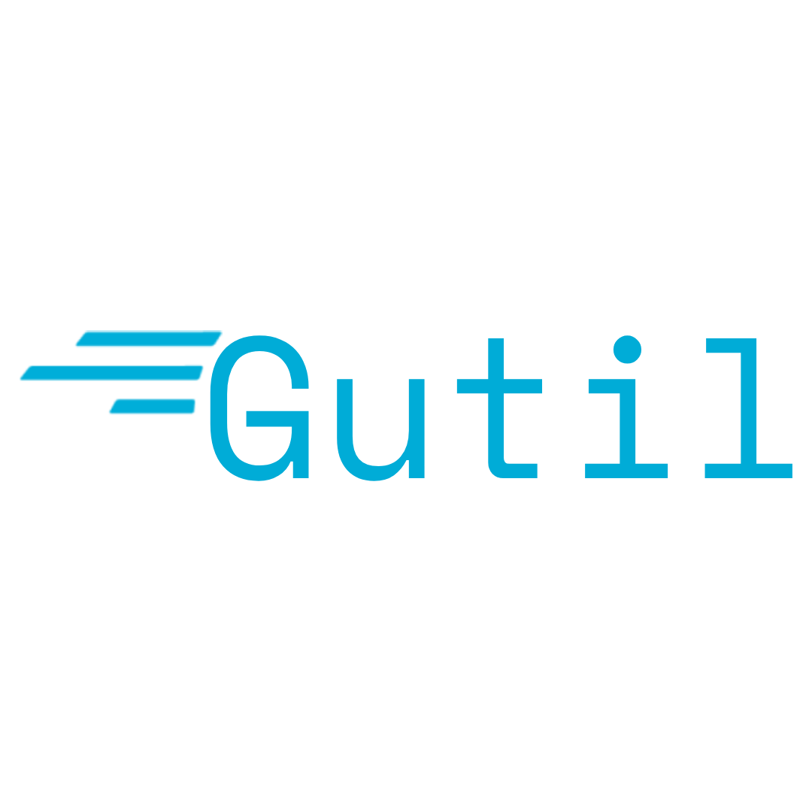

[](https://discord.gg/EvYB9ZgYvV)

# gutil

Golang util library by Zurvan

# Install

```
go get -u github.com/zurvan-lab/gutil@latest
```

# Utils set

<!-- TODO -->

# Contributing

Contributions to Gutil are appreciated.

# License

Gutil is under the [MIT](./LICENSE) License.
